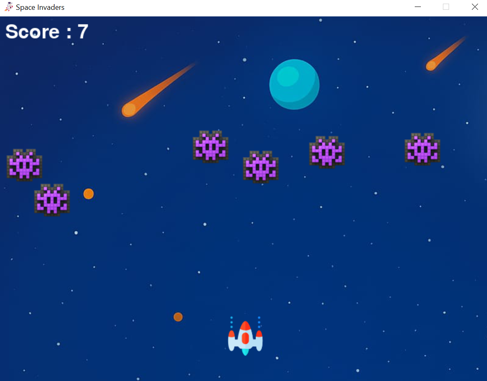

# 👾 Space Invader Game

A classic **2D Space Invader** arcade game developed using **Python** and **Pygame**. 
Control the spaceship, eliminate enemy invaders, avoid collisions, and achieve the highest score in this fun retro-style game.

---

## 🚀 Features

- 👨‍🚀 Player-controlled spaceship
- 🔫 Smooth shooting mechanics
- 👾 Multiple enemy invaders
- 🎯 Collision detection
- 🏆 Real-time score tracking
- 💥 Game Over system
- 🎮 Responsive keyboard controls
- ⚡ Fast-paced arcade gameplay

---

## 🛠️ Tech Stack

- **Python**
- **Pygame**

---

## 📂 Project Structure

```text
space-invader-game/
│── main.py             # Main game file
│── player.png          # Player sprite
│── enemy.png           # Enemy sprite
│── bullet.png          # Bullet sprite
│── background.png      # Background image
│── explosion.wav       # Sound effects (optional)
│── README.md
```

> *The file names above are examples. Update them to match your project if they are different.*

---

## 📸 Screenshot




---

## ⚙️ Installation

### 1. Clone the Repository

```bash
git clone https://github.com/your-username/space-invader-game.git
```

### 2. Navigate to the Project

```bash
cd space-invader-game
```

### 3. Install Pygame

```bash
pip install pygame
```

### 4. Run the Game

```bash
python main.py
```

---

## 🎮 Controls

| Key | Action |
|------|--------|
| ⬅️ Left Arrow | Move Left |
| ➡️ Right Arrow | Move Right |
| Spacebar | Shoot |
| Esc | Exit Game |

---

## 🎯 Gameplay

- Move your spaceship left and right.
- Shoot enemy invaders before they reach the bottom.
- Earn points by destroying enemies.
- The game ends when an enemy reaches the player or the bottom of the screen (depending on your implementation).

---

## 📈 Future Enhancements

- Multiple difficulty levels
- Boss enemies
- Power-ups and shields
- Sound effects and background music
- Pause and resume functionality
- High score saving
- Animated explosions
- Multiple lives system

---

## 👨‍💻 Author

**Muhammad Bilal**

- **GitHub:** https://github.com/CodeWith-MB
- **LinkedIn:** https://www.linkedin.com/in/muhammad-bilal9

---

## ⭐ Support

If you enjoyed this project, consider giving it a **⭐ Star** on GitHub.
