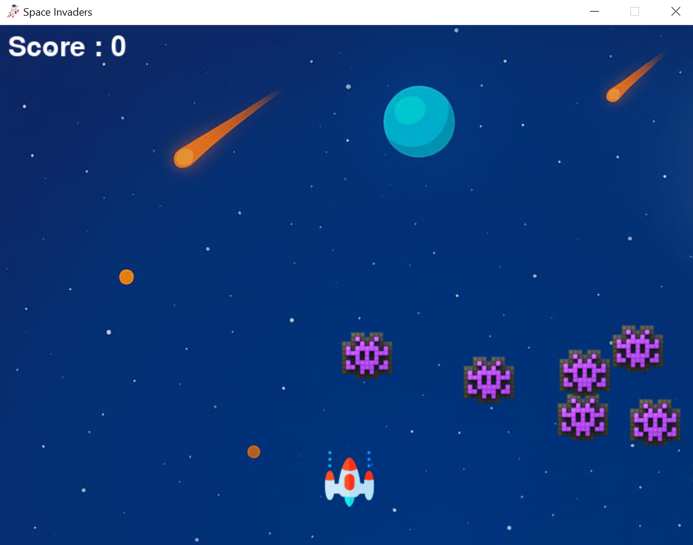
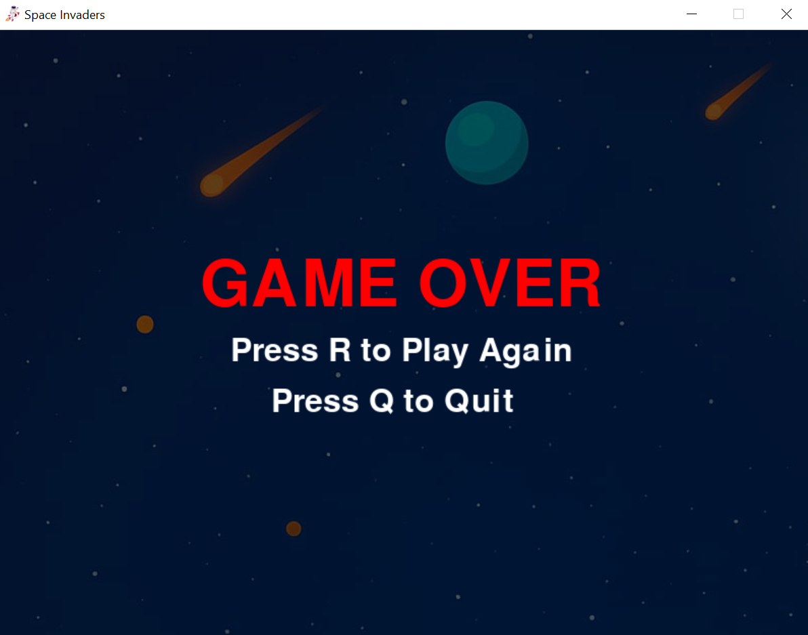

Space Invader Game (Python)

A classic Space Invader game built using Python and Pygame.

Features
- Player shooting system
- Enemy movement
- Score tracking
- Game over system

Tech Stack
- Python
- Pygame

 Gameplay

Screenshots

## Screenshots

Run Locally
bash
pip install pygame
python main.py
